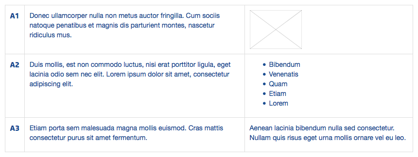

# IMPORTANT NOTICE

Please, go here: https://github.com/floriankarsten/kirby-tablex
@floriankarsten plugin is all I didn’t take the time to do!

I will not update my plugin anymore ;)

---

# Table Plugin

Based on Bastian Allgeier *Columns plugin*, is a plugin for [Kirby](http://getkirby.com/) enables a simple syntax in Kirbytext for simple table layouts with formatted content.



## Installation

[Download the plugins repository](https://github.com/julien-gargot/kirby-plugin-table/archive/master.zip) and copy `table.php` to `/site/plugins` of your site.

## Example usage in Kirbytext

```
(table…)

##### A1

(…column…)

Donec ullamcorper nulla non metus auctor fringilla. Cum sociis natoque penatibus et magnis dis parturient montes, nascetur ridiculus mus.

(…column…)

(image: default.jpg)

(…row…)

##### A2

(…column…)

Duis mollis, est non commodo luctus, nisi erat porttitor ligula, eget lacinia odio sem nec elit. Lorem ipsum dolor sit amet, consectetur adipiscing elit.

(…column…)

- Bibendum
- Venenatis
- Quam
- Etiam
- Lorem

(…row…)

##### A3

(…column…)

Etiam porta sem malesuada magna mollis euismod. Cras mattis consectetur purus sit amet fermentum.

(…column…)

Aenean lacinia bibendum nulla sed consectetur. Nullam quis risus eget urna mollis ornare vel eu leo.

(…table)
```

The `(…row…)` (previously `++++`) seperator is used to divide text into rows. The `(…column…)` (previously `////`) seperator is used to divide text into columns. Just make sure to provide the same number of columns for each row. For the opening and closing *table*, *row* and *column* tags you can either use the more elegant ellipsis … (`Alt+.` on a Mac or `AltGr+Shift+,` on certain Linux distribution) or three dots.

```
(table…)

(…table)
```

or

```
(table...)

(...table)
```

The `++++` and `////` are still supported. It let choose between a more verbose or more ASCII-art writing style.

## Modifying class names

Class names for the table can be modified in your config:

```php
c::set('table.container', 'table');
```

Optionally you can wrap the table with the following setting:

```php
c::set('table.wrap', '<div class="table-responsive">|</div>');
```
